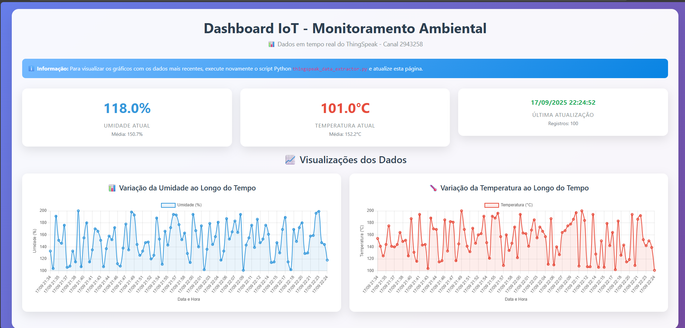

# 🌡️ Dashboard IoT - Monitoramento Ambiental

Um dashboard web interativo para monitoramento de dados ambientais em tempo real, desenvolvido com Python Flask e Chart.js.


## 📋 Sobre o Projeto

Este projeto foi desenvolvido como parte dos trabalhos acadêmicos do SENAC Pernambuco, com o objetivo de criar uma solução completa para visualização de dados IoT de sensores ambientais.

O dashboard coleta dados de sensores de temperatura e umidade através da plataforma ThingSpeak e apresenta essas informações de forma visual e interativa através de gráficos dinâmicos.

## ✨ Funcionalidades

-  **Gráficos Interativos**: Visualização em tempo real dos dados de temperatura e umidade
-  **Atualização Automática**: Dashboard atualiza automaticamente a cada 60 segundos
-  **Design Responsivo**: Interface adaptável para diferentes tamanhos de tela
-  **Fuso Horário Brasileiro**: Dados convertidos automaticamente para o horário de Brasília
-  **Estatísticas em Tempo Real**: Valores atuais, médias e totais de registros
-  **Interface Moderna**: Design clean com gradientes e animações suaves

## 🛠️ Tecnologias Utilizadas

- **Backend**: Python 3.x, Flask
- **Frontend**: HTML5, CSS3, JavaScript
- **Gráficos**: Chart.js
- **Estilização**: Bootstrap 5
- **API**: ThingSpeak REST API
- **Processamento de Dados**: Pandas, Requests
- **Fuso Horário**: pytz

## 📁 Estrutura do Projeto

```
projeto-iot-senac/
├── dashboard_advanced.py          # Aplicação Flask principal
├── thingspeak_data_extractor.py  # Script para extração de dados
├── templates/
│   └── dashboard.html            # Template HTML do dashboard
├── test_api.py                   # Testes da API
└── README.md                     # Documentação do projeto
```

## 🚀 Como Executar

### Pré-requisitos

- Python 3.7 ou superior
- pip (gerenciador de pacotes Python)

### Instalação

1. Clone o repositório:
```bash
git clone https://github.com/seu-usuario/dashboard-iot-senac.git
cd dashboard-iot-senac
```

2. Instale as dependências:
```bash
pip install flask pandas requests pytz
```

3. Execute o dashboard:
```bash
python dashboard_advanced.py
```

4. Acesse o dashboard no navegador:
```
http://localhost:5000
```

## 📊 Funcionalidades do Dashboard

### Métricas em Tempo Real
- **Umidade Atual**: Valor mais recente do sensor com média histórica
- **Temperatura Atual**: Leitura atual com estatísticas de média
- **Última Atualização**: Timestamp da última coleta de dados
- **Total de Registros**: Quantidade de medições disponíveis

### Gráficos Interativos
- **Gráfico de Umidade**: Linha temporal mostrando variações de umidade
- **Gráfico de Temperatura**: Visualização das mudanças de temperatura ao longo do tempo
- **Interatividade**: Hover para ver valores específicos, zoom e navegação

## 🎯 Objetivos Acadêmicos

Este projeto demonstra a aplicação prática de conceitos aprendidos em:

- **Desenvolvimento Web**: Criação de aplicações Flask
- **APIs REST**: Integração com serviços externos
- **Visualização de Dados**: Implementação de gráficos interativos
- **IoT**: Coleta e processamento de dados de sensores
- **Frontend Moderno**: Uso de frameworks CSS e bibliotecas JavaScript

## 🔧 Configuração Avançada

### Personalização dos Gráficos
Os gráficos podem ser personalizados editando as configurações no arquivo `dashboard.html`:
- Cores dos gráficos
- Intervalos de atualização
- Tipos de visualização
- Escalas dos eixos




**Nota**: Este é um projeto educacional desenvolvido para demonstrar conceitos de IoT, desenvolvimento web e visualização de dados.
